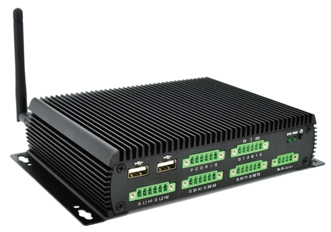
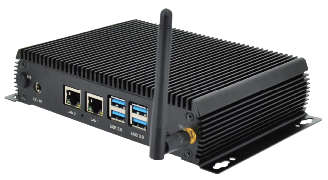
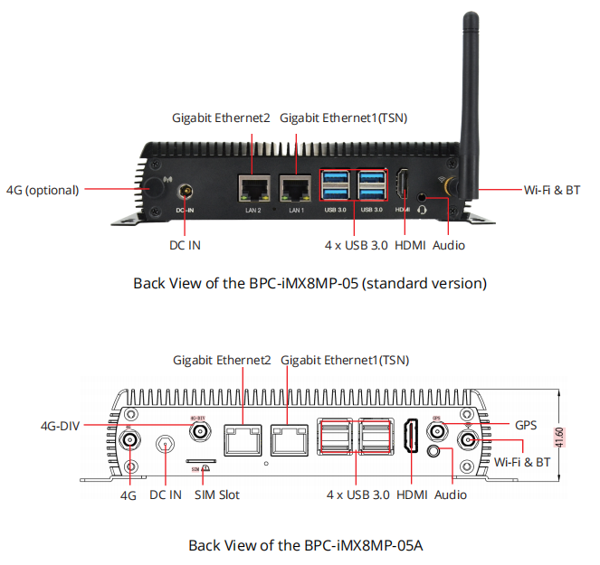
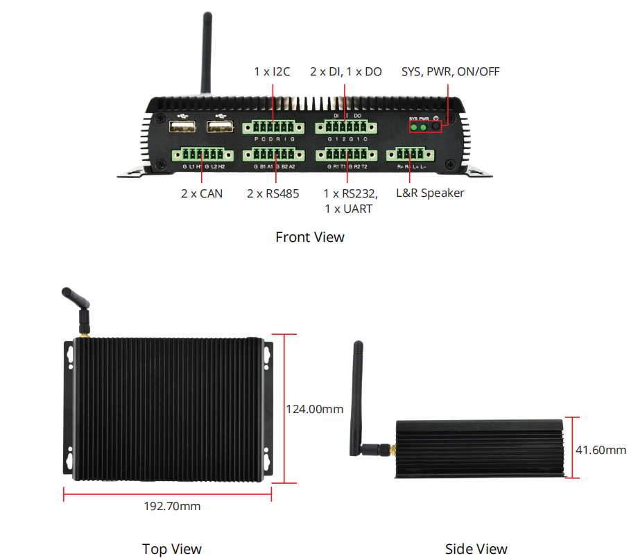

# DEBIX BPC-iMX8MP-05 Industrial Computer

## Overview
BPC-iMX8MP-05 Industrial Computer is a compact and durable box PC that is powered by a DEBIX SOM A core board and a DEBIX SOM A I/O Board carrier board. It features a fanless design and a solid steel & aluminum enclosure, making it ideal for use in harsh industrial environments.

## Main Features
- **Durable:** Solid steel and aluminum enclosure

- **Modular:** Utilizes DEBIX SOM A core board and DEBIX SOM A I/O Board carrier board for flexibility

- **Multiple boot options:** Support eMMC, Micro SD and SPI Nor Flash(reserved)
  
- **Software Compatibility:** Support Windows IoT, Ubuntu, Yocto, Debian, Android, OpenWRT, and FreeRTOS operating systems
  
- **Powerful connectivity:** Include dual Gigabit network, 2.4GHz&5GHz Wi-Fi 5, Bluetooth 5.0 and one Mini PCIe for 4G module/LoRa module/network card

- **Rich and isolated I/O:** 4 x USB 3.0, 2 x USB 2.0 and isolated interfaces: 2 x RS485, 1 x RS232, 2 x CAN, 2 x DI, 1 x DO

## Specification
| System          |       |
|-----------------|-------|
| Motherboard | DEBIX SOM A (Core Board) + DEBIX SOM A I/O Board (Carrier Board)  |
| Boot            | (1) Support boot from eMMC on DEBIX SOM A (default) (2) Support boot from Micro SD on carrier board (3) Support boot from SPI Nor Flash on carrier board (reserved)  |
| Memory          | Onboard 2GB LPDDR4 (1GB/4GB/8GB optional)  |
| Storage         | Onboard 16GB eMMC (8GB/32GB/64GB/128GB/256GB optional)  |
| OS              | Win10 IoT Enterprise, Ubuntu 22.04, Yocto-L6.1.22_2.2.0, Debian 12 (also supports Android, OpenWRT and FreeRTOS.) |
|**Communication**|
| Gigabit Ethernet| 2 x Independent MAC Gigabit Ethernet ports with POE power supply (need POE power device module) (one supports TSN) |
| Wi-Fi & Bluetooth| 2.4GHz&5GHz Wi-Fi and Bluetooth 5.0, external SMA antenna for Wi-Fi & BT |
|**Video & Audio**|
| Display | 1 x HDMI output |
| Audio   | 1 x Headphone and mic combo port 1 x 4Pin L&R speaker |
|**External I/O**|
| Antenna |2 x external SMA antenna connectors for Wi-Fi&BT (default) and 4G/LoRa (optional)|
| DC IN   |1 x Power socket for 5.5mm x 2.1mm plug|
| USB 3.0 | 4 x USB 3.0 Host |
| USB 2.0 | 2 x USB 2.0 Host |
| Serial Ports | (1) 1 x I2C (2) 2 x Isolated CAN (3) 2 x Isolated RS485 (4) 1 x Isolated RS232  (5) 1 x UART|
| GPIO | (1) 2 x Isolated DI, support dry contact and wet contact (2) 1 x Isolated DO, support wet contact, compatible with dry contact of external relay |
| LED & KEY  | (1) 1 x System LED (2) 1 x Power LED (3) 1 x ON/OFF |
|**Internal I/O**|
| SIM Slot | 1 x Built-in Micro SIM slot, push pop-up slot |
| SD Slot | 1 x Built-in Micro SD slot, push pop-up slot |
| Mini PCIe | (1) Support 4G module such as Quectel 4G module, built-in SIM card, etc. (2) Support LoRa module (3) Support other expansion such as network card, SATA and serial port |
|**Power Supply**|
| Power Input | DC 12V/2A power input for default, supports DC 12V~36V |
|**Mechanical & Environmental**|
| Enclosure Material | Steel and aluminum alloy  |
| Dimension | 192.70(W)mm × 41.60(H)mm x 124.00(D)mm (±0.5mm) (included wall brackets)  |
| Gross Weight | 830g (±0.5g)  |
| Operating Temp. | -20°C to 70°C (-40°C to 85°C optional) |

## Product Variant 
BPC-iMX8MP-05 (standard version) variant, see the table below for details.
|Variant Name| Differences from Base Product |
|---|---|
| BPC-iMX8MP-05A | 1. SIM slot was revised to external I/O 2. Support 3 external SMA antenna connectors for GPS, 4G, and 4G-DIV  |

## Product Compliance and Safety
CE | FCC | UKCA | RoHS | RCM  
*For more information see [the Certificates in the DEBIX Knowledge Center](https://debix.io/Document/certificates.html)*  

## I/O Interfaces and Dimension:

## Ordering Codes
| RAM LPDDR4  | eMMC Storage | PN for BPC-iMX8MP-05 -20°C to 70°C | PN for BPC-iMX8MP-05 -40°C to 85°C |
|-------------|--------------|----------------|---------------------|
| **1GB DDR** | 8GB   | BPC-iMX8MP-05-D1E8    | BPC-iMX8MP-05-I-D1E8 |
|             | 16GB  | BPC-iMX8MP-05-D1E16   | BPC-iMX8MP-05-I-D1E16 |
|             | 32GB  | BPC-iMX8MP-05-D1E32   | BPC-iMX8MP-05-I-D1E32 |
|             | 64GB  | BPC-iMX8MP-05-D1E64   | BPC-iMX8MP-05-I-D1E64 |
| **2GB DDR** |  8GB   | BPC-iMX8MP-05-D2E8    | BPC-iMX8MP-05-I-D2E8 |
|             | 16GB  | BPC-iMX8MP-05-D2E16   | BPC-iMX8MP-05-I-D2E16 |
|             | 32GB  | BPC-iMX8MP-05-D2E32   | BPC-iMX8MP-05-I-D2E32 |
|             | 64GB  | BPC-iMX8MP-05-D2E64   | BPC-iMX8MP-05-I-D2E64 |
| **4GB DDR** | 8GB   | BPC-iMX8MP-05-D4E8    | BPC-iMX8MP-05-I-D4E8 |
|             | 16GB  | BPC-iMX8MP-05-D4E16   | BPC-iMX8MP-05-I-D4E16 |
|             | 32GB  | BPC-iMX8MP-05-D4E32   | BPC-iMX8MP-05-I-D4E32 |
|             | 64GB  | BPC-iMX8MP-05-D4E64   | BPC-iMX8MP-05-I-D4E64 |
| **8GB DDR** | 8GB   | BPC-iMX8MP-05-D8E8    |    |
|             | 16GB  | BPC-iMX8MP-05-D8E16   |    |
|             | 32GB  | BPC-iMX8MP-05-D8E32   |    |
|             | 64GB  | BPC-iMX8MP-05-D8E64   |    |

## Compatible with DEBIX's Accessories
| Product                     | Model               |
|-----------------------------|---------------------|
| DEBIX Display Screens      | DEBIX TD050H; DEBIX TD070H; DEBIX TD101H |

## Safety Instructions and Warnings:
- Disconnect the device from the DC power supply before cleaning. Use a damp rag. Do not use liquid detergents or spray-on detergents.
  
- Keep the device away from moisture.

- During installation, put the device on a reliable table. It will be damaged if you drop it.

- Before connecting the power supply, ensure that the voltage is in the required range.

- Put the power cable in place to avoid stepping on it.

- If the device is not used for a long time, power it off to avoid damage caused by sudden overvoltage.

- For safety reasons, the device can only be disassembled by professional personnel.

- Do not place the device in a place where the ambient temperature is below -40℃ or above 85℃. This will damage the machine. It needs to be kept in an environment at controlled temperature.

## Contact Us
- **Headquarters**: DEBIX Technology Inc., 8345 Gold River Ct., Las Vegas, NV 89113, USA  
- **Factory**: 5-6/F., East Zone, Shunheda A2 Building, Liqxiandong Industrial Park, XiLi, Nanshan Dist., Shenzhen, China  
- **Email**: info@debix.io  
- **Website**: [www.debix.io](https://www.debix.io)  
- **Community**: [Discord](https://discord.com/invite/adaHHaDkH2)